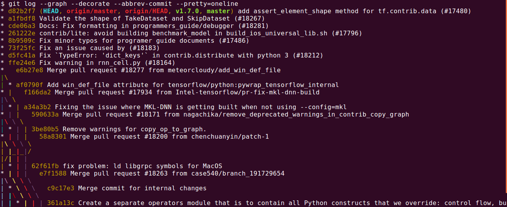
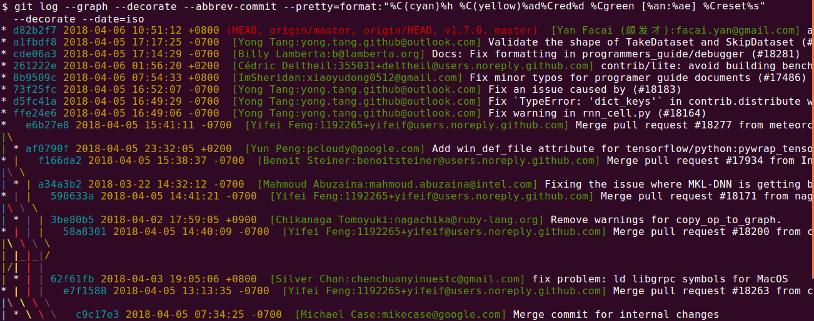

# Table of Contents
- [Introduction](#intro)
- [Log viewing](#log_viewing)
- [Tags](#tags)
- [Repo clean](#repo_cleanup)
- [Setup SSH keys](#ssh_keys)
- [Remove remote branch](#remove_remote_branch)

<a name="intro"></a>
## Introduction
- GIT commands of daily use.

<a name="log_viewing"></a>
## Log viewing
- Simple view
`git log --graph --decorate --abbrev-commit --pretty=oneline`


- Log with date/time + author
`git log --graph --decorate --abbrev-commit --pretty=format:"%C(cyan)%h %C(yellow)%ad%Cred%d %Cgreen [%an:%ae] %Creset%s" --decorate --date=iso`


<a name="tags"></a>
## Log viewing
- `git tag -l | sort -V` - See tags in the sort order

<a name="repo_cleanup"></a>
## Repo Cleanup
```
git reflog expire --expire=now --all
git gc --prune=now
git stash clear
```

<a name="ssh_keys"></a>
## Setup SSH keys
- [Setup SSH keys](https://help.github.com/articles/connecting-to-github-with-ssh/)

<a name="remove_remote_branch"></a>
## Remove remote branch
```
git remote rm destination

cd into/cloned/fork-repo
git status
git fetch upstream
git pull upstream master
```
